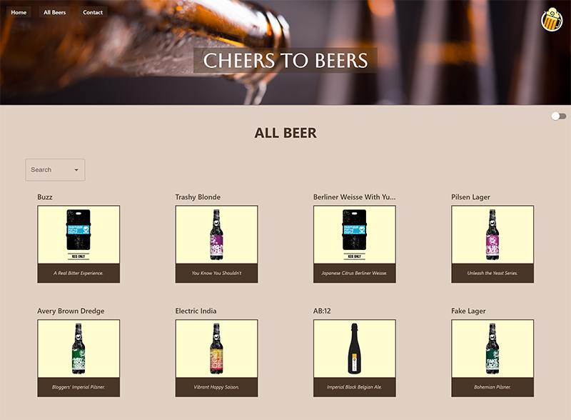

# "Cheers to Beers"

## Desktop

## Mobile

## About the project

An application that allows users to access information about 25 different types of beers. The information ranges from general details (ABV, etc.) to more detailed information about manufacturing and ingredients. This application is designed for people who appreciate beer and its various flavors.

## Objectives

### Creation of a single-page application (SPA) using React and React Router.

The project was implemented using several hooks, including a custom API call hook. The dark mode was applied using useContext. Material UI was used for creating an Autocomplete, a Select menu, and implementing a switch button for the dark mode.

## Coding Technologies Used

 

## Design

The application's design follows the Figma boards, which you can find [HERE](https://www.figma.com/file/5ew9eQDitMm7Z6GtSyPWCR/Cheers-To-Beers?type=design&node-id=0-1&mode=design&t=iwReJuNZLt6QECCG-0)
